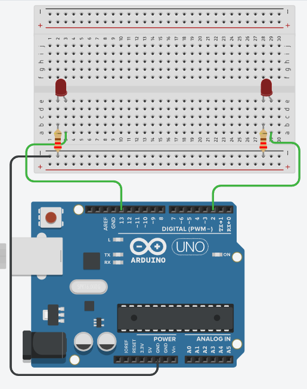

# Blinking Lights

## Topics covered

"At the end of this learning brief, you will be able to answer the following questions"

* How to use `pinMode()` to set up a digital pin to be written to
* How to use `digitalWrite()` to write and turn a pin on
* How to use `digitalRead()` to write and turn a pin off
* How to use use `delay()` to pause the program for a moment

## Learning Resources

* [pinMode()](https://www.arduino.cc/reference/en/language/functions/digital-io/pinmode/)
* [digitalWrite()](https://www.arduino.cc/reference/en/language/functions/digital-io/digitalwrite/)
* [delay()](https://www.arduino.cc/reference/en/language/functions/time/delay/)

## Topics

### Blinking lights

This is the hello world for electronics, making an LED flash.

```cpp
void setup() {
  pinMode(13, OUTPUT);    // sets the digital pin 13 as output
}

void loop() {
  digitalWrite(13, HIGH); // sets the digital pin 13 on
  delay(1000);            // waits for a second
  digitalWrite(13, LOW);  // sets the digital pin 13 off
  delay(1000);            // waits for a second
}
```

If you look at your Arduino, you will see that the on board LED (L) is flashing: 


### Topic 2

Let's expand that with two LEDs.



```cpp
int pinLeft = 13;
int pinRight = 2;
void setup()
{
  pinMode(pinLeft, OUTPUT);
  pinMode(pinRight, OUTPUT);
}

void loop()
{
  digitalWrite(pinLeft, HIGH);
  digitalWrite(pinRight, LOW);
  delay(1000); // Wait for 1000 millisecond(s)
  digitalWrite(pinLeft, LOW);
  digitalWrite(pinRight, HIGH);
  delay(1000); // Wait for 1000 millisecond(s)
}
```


