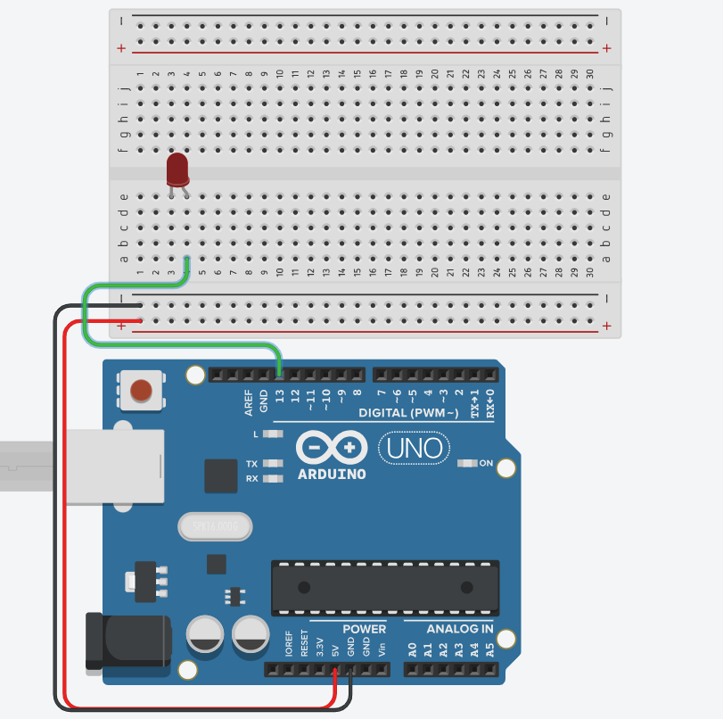
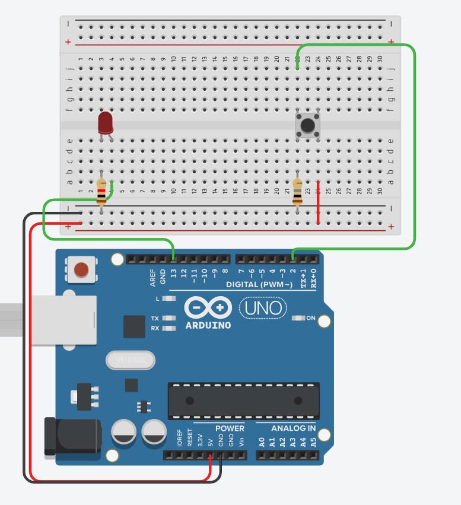

# Robotics 11 Practice Exam 


## Variables and conditions 

1. Which of the following correctly declares an integer variable named sensorValue and assigns it a value of 100?

A) sensorValue = 100;  
B) int sensorValue = 100;  
C) var sensorValue = 100;  
D) integer sensorValue = 100;  


2. What will the following code output to the Serial Monitor? 

```cpp
int temperature = 30;

if (temperature > 25) {
  Serial.println("Hot");
} else {
  Serial.println("Cold");
}
```

A) Hot  
B) Cold  
C) 30  
D) Error: Invalid syntax  

3. Which of the following statements best describes the role of a condition in an Arduino if statement?

A) It stores data in the microcontroller's memory.  
B) It continuously loops the code inside the if block.  
C) It evaluates to either true or false to control program flow.  
D) It assigns values to variables inside the if block.  

4. Consider the following Arduino code:

```cpp
int value = 5;

void setup() {
  Serial.begin(9600);
  int value = 10;  

  if (value > 7) {
    Serial.println("High");
  }

  if (value < 3) {
    Serial.println("Low");
  }

  Serial.println(value);
}

void loop() {}

```

What will be printed to the Serial Monitor?


5. Analyze this code snippet:

```cpp
int counter = 0;

void setup() {
  Serial.begin(9600);

  counter = counter + 3;

  if (counter == 3) {
    Serial.println("Three");
    counter = counter * 2;
  }

  if (counter == 6) {
    Serial.println("Six");
  } else {
    Serial.println("Not Six");
  }

  Serial.println("Final: " + String(counter));
}

void loop() {}
```

What will be printed to the Serial Monitor? Explain each step.


6. Given this code: 

```cpp
int temp = 20;

void setup() {
  Serial.begin(9600);

  if (temp >= 15) {
    Serial.println("Warm");
    temp = temp - 5;
  }

  if (temp == 15) {
    Serial.println("Exactly 15");
  }

  if (temp < 15) {
    Serial.println("Cool");
  }

  Serial.println("Temp is: " + String(temp));
}

void loop() {}

```

List the exact output printed to the Serial Monitor and explain any or all lines which appears. 


7. Agatha is working on an arduino project, but their code isn't behaving as expected. Look at the following code and identify at least 5 unique issues that could be causing their problem: 

```cpp
int voltage = 5;
int threshold = 10;
int reading;

void setup() {
  Serial.begin(9600);
  
  reading = voltage + 3;

  if (reading = threshold) { 
    Serial.println("Threshold Met");
  } 

// Line: if (reading = threshold)
// Issue: Assigns threshold to reading instead of comparing.
// Fix: Replace with if (reading == threshold)

  if (reading < threshold); {  
    Serial.println("Below Threshold");
  }

// Line: if (reading < threshold);
// Issue: The semicolon ends the if statement prematurely
// Fix: Remove the semicolon: if (reading < threshold)

  if (reading > threshold) {
    Serial.println("Above Threshold");
  }

  if (threshold) 
    Serial.println("Threshold is Active");

// Line: if (threshold)
// Issue: This checks if threshold is non-zero, not a specific condition.
// Fix: Make the condition explicit, e.g., if (threshold > 0)
  
  if (reading + 5 > threshold) {
    reading = reading++;    
    Serial.println("Adjusted Reading: " + String(reading));
  }

// Line: reading = reading++;
// Issue: Post-increment returns the original value before incrementing, so the assignment cancels the increment.
// Fix: Use reading++; or reading += 1;

  if (reading - 3 = 5) {  
    Serial.println("Special Condition Met");
  }
// Line: if (reading - 3 = 5)
// Issue: Uses = instead of == for comparison.
// Fix: Change to if (reading - 3 == 5)


  if (voltage) {
    int voltage = 12; 
    Serial.println("Voltage: " + String(voltage));
  }

// Line: int voltage = 12; inside the if block
// Issue: Declares a new local voltage, hiding the global one, leading to potential confusion.
// Fix: Remove int to use the global variable: voltage = 12;


  if (threshold == 0) (  
    Serial.println("Threshold Disabled");
  )

// Line: if (threshold == 0) ( (and technically the last line of the condition)
// Issue: wrong bracing leading to a complation error
// Fix: Use appropriate bracing { } instead of ( )

}

void loop() {}

```


Identify at least 5 unique issues in the code.
For each issue:
1. State the problem clearly.
2. Explain why it would cause unintended behavior.
3. Suggest a fix.


```bash


```


 


## functions 

1. Which of the following correctly defines a function in Arduino that takes two integers as parameters and returns their sum?

```cpp
A) int add(a, b) { return a + b; }
B) void add(int a, int b) { return a + b; }
C) int add(int a, int b) { return a + b; }
D) function add(int a, int b) -> int { return a + b; }
```

2. What will the following code print to the Serial Monitor

```cpp
int multiplyByTwo(int num) {
  return num * 2;
}

void setup() {
  Serial.begin(9600);
  int result = multiplyByTwo(5);
  Serial.println(result);
}

void loop() {}

```

A) 5  
B) 10  
C) 2  
D) Error: Invalid function call


3. What will the following code output to the Serial Monitor?

```cpp
int adjustValue(int x) {
  if (x < 10) {
    return x + 5;
  }
  return x - 5;
}

void setup() {
  Serial.begin(9600);
  int a = adjustValue(7);
  int b = adjustValue(12);
  Serial.println(a);
  Serial.println(b);
}

void loop() {}
```

a) 
```cpp
7  
12  
```

b)
```cpp
12  
7 
```

c)
```cpp
12  
5
```

d)
```cpp
7  
7
```

4. Examine the following code:

```cpp
int doubleValue(int num) {
  return num * 2;
}

int increment(int num) {
  return num + 1;
}

void setup() {
  Serial.begin(9600);
  int a = 4;
  int b = doubleValue(a);
  int c = increment(b);

  Serial.println(a);
  Serial.println(b);
  Serial.println(c);
}

void loop() {}


```

What will be printed to the Serial Monitor? Explain how each value is calculated.


4. Analyze this code snippet. 

```cpp
int processNumber(int x) {
  if (x < 5) {
    return x * 3;
  } 
  if (x == 5) {
    return x + 5;
  }
  return x - 2;
}

void setup() {
  Serial.begin(9600);
  Serial.println(processNumber(3));
  Serial.println(processNumber(5));
  Serial.println(processNumber(8));
}

void loop() {}

```

What will the Serial Monitor display? Provide the result for each function call and explain why.


5. Kevin is working on his project but the code isn't producing the expected results. Review the following code carefully, and identify at least 5 different issues that could cause unintended behavior or logical errors. 


```cpp
int sensorValue = 0;
int threshold = 50;

void setup() {
  Serial.begin(9600);
  sensorValue = getSensorReading();
  Serial.println("Sensor Value: " + String(sensorValue));

  if (checkThreshold(sensorValue)) {
    Serial.println("Threshold Reached");
  } else
    Serial.println("Threshold Not Reached");

  int result = doubleValue(sensorValue);
  Serial.println("Doubled Value: " + String(result));

  resetSensor(sensorValue);
  Serial.println("Sensor After Reset: " + String(sensorValue));

  missingParameter(sensorValue);
}

void loop() {}

int getSensorReading() {
  int value = 40;
  return;  
}

// Line: return;
// Issue: The function is declared to return an int but returns nothing.
// Fix: Replace with return value;

bool checkThreshold(int value) {
  if (value = threshold) { 
    return true;
  }
  if (value > threshold) {
    return true;
  }
  return false;
}

// Line: if (value = threshold)
// Issue: Assigns threshold to value instead of comparing.
// Fix: Use if (value == threshold)

int doubleValue(int value) {
  value = value * 2;
  return value;
}

void resetSensor(int value) {
  value = 0;  
}

// Line: value = 0;
// Issue: The parameter is passed by value, so changes won’t affect the original variable.
// Fix: Pass by reference: void resetSensor(int &value)

bool isPositive(int number) {
  if (number > 0)
    return true;
  else
    return;  // Issue 4?
}

// Line: return;
// Issue: The function expects a bool return but returns nothing.
// Fix: Replace with return false;

int faultyOperation(int num) {
  return num +;  
}
// Line: return num +;
// Issue: Incomplete expression causes a compilation error.
// Fix: Complete the expression, e.g., return num + 5;

int noReturnValue(int num) {  
  int result = num * 3;
}

// Line: No return statement present.
// Issue: The function is declared to return an int but doesn’t return anything.
// Fix: Add return result; at the end.

void missingParameter() {  
  Serial.println("Missing Parameter Example");
}

// Line: void missingParameter()
// Issue: The function is defined without parameters but should be called with one based on context.
// Fix: Either modify the function to accept a parameter or update its call accordingly.

```

## iteration 

1. What will the following code print to the Serial Monitor?

```cpp
void setup() {
  Serial.begin(9600);
  
  for (int i = 0; i < 3; i++) {
    Serial.println(i);
  }
}

void loop() {}
```

a)  
```cpp
0  
1  
2 
```

b)  
```cpp
1  
2  
3  
```

c)  
```cpp
0  
1  
2  
3  
```

d)  
```cpp
0  
1  
2  
```


2. Consider the following code 


```cpp
void setup() {
  Serial.begin(9600);
  
  int counter = 0;

  while (counter < 4) {
    Serial.println(counter);
    counter++;
  }
}

void loop() {}

```


a)  
```cpp
0  
1  
2  
3  

```


b)  
```cpp
1  
2  
3  
4  

```


c)  
```cpp
0  
1  
2  
3  
4  

```


d)  
```cpp
0  
1  
2  
3  

```


3. What will be printed ot the serial moninitor? 

```cpp

void setup() {
  Serial.begin(9600);
  
  for (int i = 0; i < 5; i++) {
    Serial.println("Count: " + String(i));
  }
}

void loop() {}


```

List the exact lines printed to the Serial Monitor.


4. What will the following code output to the Serial Monitor? 

```cpp
void setup() {
  Serial.begin(9600);
  
  int num = 10;

  while (num > 0) {
    Serial.println("Num: " + String(num));
    num = num - 3;
  }

  Serial.println("Finished");
}

void loop() {}
```

List the exact lines printed to the Serial Monitor.


5. Examine the following code and determine what will be printed to the Serial Monitor:


```cpp
void setup() {
  Serial.begin(9600);
  
  for (int i = 1; i <= 3; i++) {
    Serial.println("Outer Loop i = " + String(i));
    
    int j = i;
    while (j < 5) {
      Serial.println("  Inner Loop j = " + String(j));
      j += 2;
    }
  }
}

void loop() {}
```


List the exact sequence of printed lines.


## Circuits 

### If you directly connect an LED to the 5V pin on the Arduino without a resistor, what is the most likely outcome?




A) The LED will work normally.   
B) The LED will shine brighter but will be fine.   
C) The LED will burn out or possibly damage the Arduino.   
D) The Arduino will automatically limit the current.   

### What is the purpose of the resistor in this circuit?


A) To limit the current flowing through the button when pressed.   
B) To act as a pull-down resistor, ensuring the input pin reads LOW when the button is unpressed.   
C) To protect the pushbutton from voltage spikes.   
D) To reduce the LED brightness when the button is pressed.   


## Composite questions 




Using the above circuit as a guide, 

```cpp
const int buttonPin = 2;
const int ledPin = 13;
int buttonState = 0;

void setup() {
  pinMode(buttonPin, INPUT);
  pinMode(ledPin, OUTPUT);
}

void loop() {
  buttonState = digitalRead(buttonPin);

  if (buttonState == HIGH) {
    digitalWrite(ledPin, HIGH);
  } else {
    digitalWrite(ledPin, LOW);
  }
}
```

A) The LED will turn ON only when the button is pressed and turn OFF when released.   
B) The LED will always stay ON, regardless of the button press.   
C) The LED will never turn ON, even when the button is pressed.   
D) The LED will blink repeatedly when the button is pressed.   